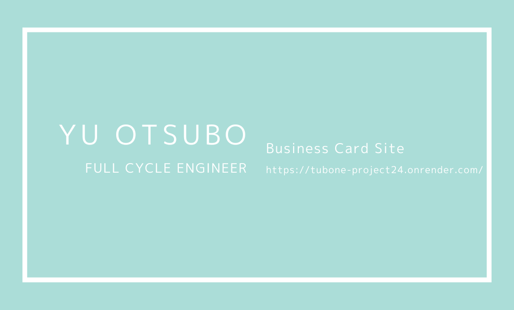
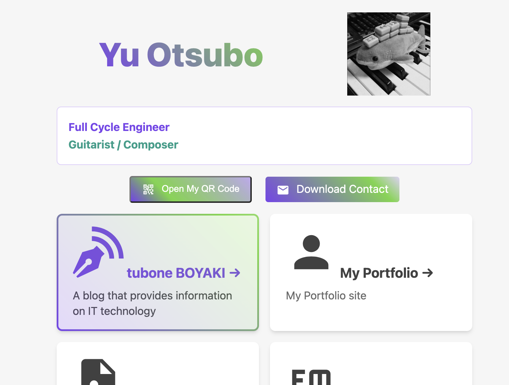
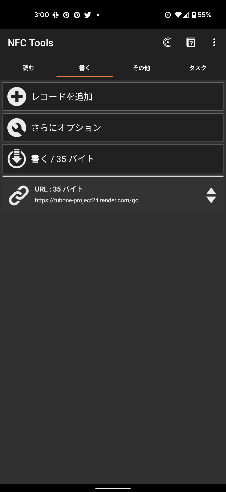
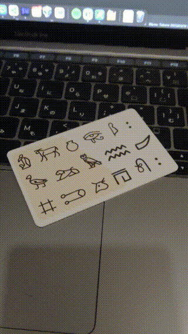
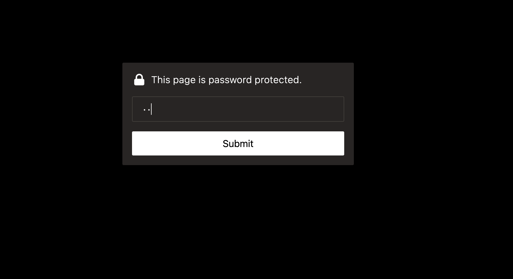

# NFC My Business Card
### ☁ Try it in the Cloud

[](https://stackblitz.com/github/tubone24/nfcMyBusinessCard/tree)
[](https://codesandbox.io/s/github/tubone24/nfcMyBusinessCard/tree)
[](https://vscode.dev/github/tubone24/nfcMyBusinessCard/tree)
[](https://codespaces.new/tubone24/nfcMyBusinessCard/tree)
[](https://gitpod.io/#https://github.com/tubone24/nfcMyBusinessCard/tree)
[](https://replit.com/github/tubone24/nfcMyBusinessCard/tree)
[](https://glitch.com/edit/#!/import/github/tubone24/nfcMyBusinessCard/tree)
[](https://app.codeanywhere.com/#https://github.com/tubone24/nfcMyBusinessCard/tree)




> Utilize NFC to realize a digital business card in the form of an NFC card to refer to a profile site.



NFC My Business Card is a web application that allows you to create a business card site with NFC with encrypted site.

## How to set up

```bash
npm install
```

And also, you need to buy [NFC card](https://www.amazon.com/Rewritable-Business-Compatible-NFC-Enabled-Devices%EF%BC%8810pcs%EF%BC%89/dp/B0BKSYWG3N/ref=sr_1_2?crid=KVQJC2CBTX8N&keywords=nfc%2Bcard&qid=1679507305&sprefix=nfc%2Bcar%2Caps%2C361&sr=8-2&th=1).

You can write the card with [NFC Tools](https://play.google.com/store/apps/details?id=com.wakdev.wdnfc&hl=ja&gl=US) for your deployed business card site.



## Run locally

```bash
npm start
```

## Development Tools

### Testing

This project includes comprehensive testing setup:

#### Unit Tests (Vitest)

Run unit tests:

```bash
npm test                # Run tests in watch mode
npm run test:run        # Run tests once
npm run test:ui         # Run tests with UI
```

#### E2E Tests (Playwright)

Run end-to-end tests:

```bash
npm run test:e2e        # Run E2E tests
npm run test:e2e:ui     # Run E2E tests with UI
```

### Linting and Formatting

#### ESLint

Check code quality:

```bash
npm run lint            # Check for linting errors
npm run lint:fix        # Auto-fix linting errors
```

#### Prettier

Format code:

```bash
npm run format          # Format all files
npm run format:check    # Check formatting
```

### Storybook

View and develop components in isolation:

```bash
npm run storybook       # Start Storybook dev server
npm run build-storybook # Build Storybook for production
```

## Build and Encrypt

Before build and encrypt, you need to set up the environment variables.

```
PASSWORD=yourpassword
```

```bash
npm run build && npm run encrypt && npm run serve
```

And you can access http://localhost:3000#yourpassword

## Demo

Touch your NFC card to your smartphone, and you can see your business card site.



### AR.js

AR.js is used to display 3D models on the profile site on your camera.


## Encrypt with Pagecrypt

If you access the site without NFC or QR code, you need to input the password to access the site.

